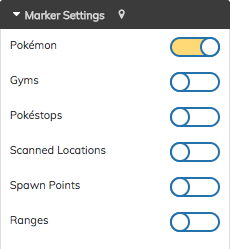
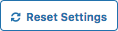

# Custom CSS styles
RocketMap supports the use of a custom CSS file to override the default selections. Use Google Chrome developer tools or Mozilla Firebug to easily find the right element selections.

## Use of custom styles
Place your custom CSS into 'custom.css' in the folder 'static/css'. *Examples are found in 'static/css/custom.css.example'.*

## CSS classes
There are four different classes added to style individual map templates. 

* Use class .mapPage for styles in map.html.
* Use class .mobilePage for styles in mobile_list.html.
* Use class .statisticsPage for styles in statistics.html.
* Use class .statusPage for styles in status.html.

### Examples
Examples below are included in custom.css.example!

**Set font-size to 11px in map.html and use default style in all other pages.**
```css
.mapPage #nav h3 {font-size: 11px;}
```
**Options menu form-control/switch-container, on/off switch style**



```css
.form-control input[type=text] {font-size: 11px !important;}
.onoffswitch-label, .onoffswitch-label:before {border-color: #256db6 !important;}
#nav .onoffswitch-checkbox:checked+.onoffswitch-label {border-color: #256db6; background-color: #ffde4e;}
.select2-container {font-size: 11px;}
```

**Options menu Reset button style**



```css
.mapPage button {border: 1px solid #256db6; background-color: #fff; color: #256db6 !important; font-size: 11px;}
.mapPage button:hover {background-color: #ffde4e;}
```
See 'custom.css.example' for more information.
