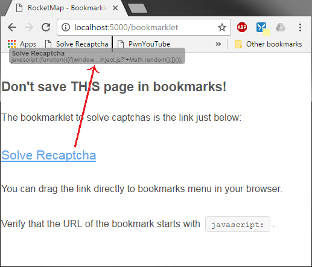
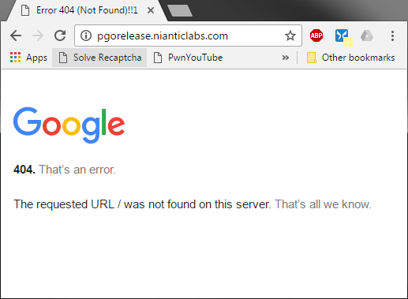
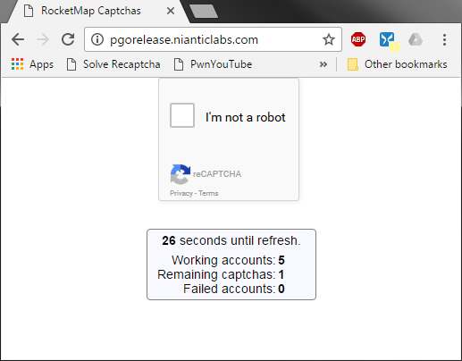

# Handling Captchas
In the following examples we will be using `http://localhost:5000` as URL where RocketMap can be accessed (i.e. front-end instance).

## Automatic Mode (2captcha)
RocketMap can request tokens for captcha solving from an external service, allowing captchas to be solved "on-the-fly" - meaning that once an account encounters a captcha it immediately starts the uncaptcha process.

If you want to enable this behavior you need to specify:
- Enable captcha solving: `-cs` / `--captcha-solving`

- 2captcha API key: `-ck` / `--captcha-key`

## Enabling Manual/Hybrid Captcha Solving:
You can setup RocketMap to enable manual captcha solving. This feature uses common web browsers to let users rescue captcha'd accounts.
We use a JavaScript [bookmarklet](https://en.wikipedia.org/wiki/Bookmarklet) that triggers a captcha which allows the user to solve it in its web browser.
The result is then forwarded to the RocketMap instance running at the URL specified by `-mcd`.

Please remember that if you want your map to be accessed from the exterior you need to setup `--host` and `--manual-captcha-domain` to something like `http://<your-ip>:<port>` or `http://<your-domain>:<port>`.

In order to enable manual captcha solving we need the following parameters:

- Enable captcha solving: `-cs` / `--captcha-solving`

- Manual captcha domain: `-mcd` / `--manual-captcha-domain`

- Provide a status name: `-sn` / `--status-name`

### Bookmarklet
The required bookmarklet to solve captchas using only the web browser can be found at:

`http://localhost:5000/bookmarklet`

After saving "Solve Recaptcha" link in your bookmarks (preferably in bookmarks menu)
you can start solving captchas!

Click the bookmarklet once to be redirected to `http://pgorelease.nianticlabs.com/`
which is normal to display a 404 error message.

The "magic" happens when you **click the bookmarklet a second time** (while remaining in the same URL).

If `-mcd` / `--manual-captcha-domain` is correct, a similar page to the one above will appear and some statistics should be visible.

- **Working accounts**: shows the total of available accounts (includes captcha'd accounts)

- **Remaining captchas**: displays the number of accounts waiting for captcha token.

 This number can take some time to refresh since the uncaptcha process can take up to a minute to complete.

- **Failed accounts**: total count of disabled accounts (can include captcha'd accounts if `--captcha-solving` is not enabled)

Accounts that were rotated to sleep when `-asi` / `--account-search-interval` is enabled will show as failed accounts.

**Remember**: Status name (`-sn` / `--status-name`) is required for RocketMap to store account statistics in the database, otherwise the captcha page will keep displaying zeros.

**Note**: When you solve a captcha you won't immediately see a change in "Remaining captchas" because the operation takes some time to validate.

### Extra Parameter: `--manual-captcha-refresh`
Simply put, this is an easy way of controlling how often you want the captcha solving page to be refreshed.

Captcha tokens (the result of solving a captcha) are only valid for a limited amount of time. This validity period starts a little bit after the bookmarklet loads, when recaptcha code is also loaded. This means that if the captcha is solved after a minute or two of browser idle time, the resulting token will not verify challenge and account will remain on hold.

- Manual captcha refresh: `-mcr 30` / `--manual-captcha-refresh 30`

The default value is `30` seconds because we had good results with it during our tests.

## Hybrid Mode
RocketMap also allows an hybrid mode for captcha solving.

This works by first putting the account aside and waiting for manual captcha solve. After `x` seconds you can force the captcha to be solved by the automatic method (2captcha).

To enable this behavior you need to specify:
- Enable captcha solving: `-cs` / `--captcha-solving`

- 2captcha API key: `-ck` / `--captcha-key`

- Manual captcha timeout: `-mct 1800` / `-manual-captcha-timeout 1800`

The number `1800` indicates how many seconds you want the accounts to wait for manual tokens before resorting to the automatic method (a.k.a. 2captcha).

- Provide a status name: `-sn` / `--status-name`

By default `--manual-captcha-timeout` is set to `0` which disables hybrid mode and only automatic captcha solve will be used. If you provide `--captcha-key` and wish to enable hybrid mode then, `--manual-captcha-timeout` needs to be greater than `0`.

### Sample configuration: Hybrid mode
    status-name: My Server 1
    captcha-solving: True
    captcha-key: <2Captcha API Key>
    manual-captcha-domain: http://<mydomain.com>:<port>
    manual-captcha-timeout: 1800
