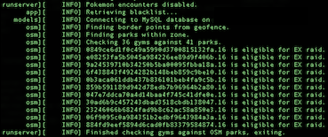
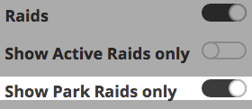
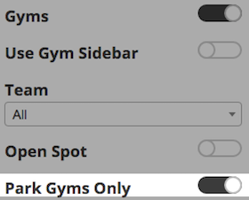

# EX Raids

EX-raids in Pokémon Go appear at gyms in parks, playgrounds and leisure areas.

RocketMap includes a built-in tool to check if existing gyms fall inside these areas.

## How to check your area

  - Scan your area normally until you have all gyms you wish to check.
  - Run a single instance with a [geofence](geofences.md) and the `-exg` flag.  
  `python runserver.py -exg -gf geofences/yourGeofence.txt`
  - Remove the `-exg` flag and run normally.

Please note, only the first area in the your geofence file will be used.  
Output for running with `-exg`(`--ex-gyms`) should be similar to:

    

If you're scanning for [gym-info](gyminfo.md) the output will contain the name of the gym instead of its ID.  
Please note, your geofence will be used to determine what area is queried from overpass. Do not use a larger geofence than necessary as it will take longer to query results and check your existing gyms.

Once your check is completed, you can check for gyms or raids in confirmed park areas by these toggles:  
    

  

## Extra

More specifically, a gym that could spawn an EX raid will have the center of its s2 level 20 cell inside a confirmed park area.
You can manually check for s2 cells [here](http://s2.sidewalklabs.com/regioncoverer/).  

The in-game information for parks is slightly outdated. Unfortunately if a park in your area was added to OpenStreetMap after July of 2016, it will currently not be eligible for EX raids.  
You can manually check for what areas are considered parks [here](http://overpass-turbo.eu/) with the following query:  

```
[out:json]
    [date:"2016-07-10T00:00:00Z"]
    [timeout:620]
	[bbox:{{bbox}}];
    (
    //Tags that are confirmed to classify gyms as 'parks' for EX Raids
        way[leisure=park];
        way[landuse=recreation_ground];
        way[leisure=recreation_ground];
        way[leisure=pitch];
        way[leisure=garden];
        way[leisure=golf_course];
        way[leisure=playground];
        way[landuse=meadow];
        way[landuse=grass];
        way[landuse=greenfield];
        way[natural=scrub];
        way[natural=heath];
        way[natural=grassland];
        way[landuse=farmyard];
        way[landuse=vineyard];
        way[landuse=farmland];
        way[landuse=orchard];
    );
    out body;
    >;
    out skel qt;
```
