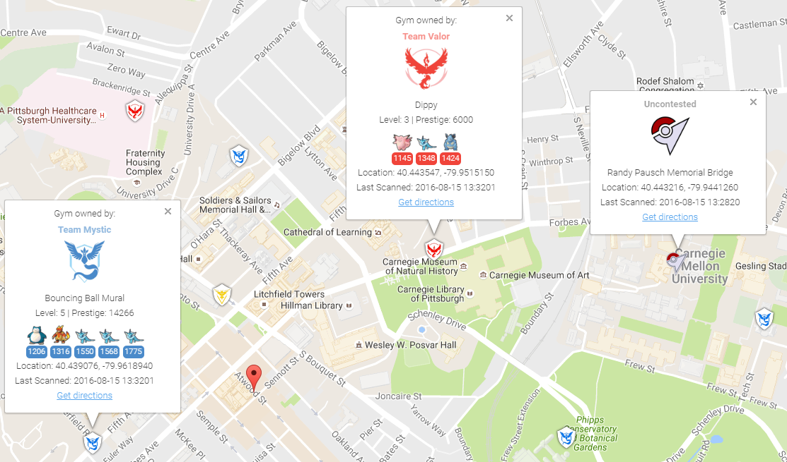

# Detailed Gym Data


To collect all of the available information about gyms, you can enable gym info parsing.

Gym info parsing adds the gym's name and a list of all the Pokemon currently in the gym to the GUI. However, this comes at a slight cost: An extra API call is made for each gym to be updated, which slows the overall scan speed. Gym information is parsed intelligently, and only updates if something about the gym has changed since it was last updated.

## MySQL Recommended
Because of the increased data being sent to the database, it is recommended to use MySQL when using this feature.

### Note on Non-Latin Characters in MySQL
Using out of the box settings, MySQL uses a collation/encoding that does not support non-Latin characters. If gyms in your area are displaying with `????` instead of the correct characters, you need to update your database server's collation and encoding to use UTF8. To correct just the gym names, run:
```sql
ALTER TABLE `gymdetails` COLLATE='utf8_general_ci', CONVERT TO CHARSET utf8;
```
As gym details are refreshed, the correct characters will appear (to force this, you can empty `gymdetails`). More information regarding MySQL encoding is available [here](http://dev.mysql.com/doc/refman/5.7/en/charset-unicode.html).

## Enabling Gym Information Parsing

To enable gym parsing, run with the `-gi` argument:
```
python runserver.py -gi
```

Or update your config.ini:

```
gym-info			# enables detailed gym info collection (default false)
```

## Displaying the gym details sidebar in the front-end

To show the gym details sidebar on the front-end, ``-gi`` needs to be enabled on your webserver instance. To scan gyms for the gym details, ``-gi`` must also be enabled on your scanner instances.

## New Webhook

When gym info parsing is enabled, gym details will be sent to webhooks. A sample webhook is below for reference:

```json
{
	"message": {
		"id": "4b432a31c3c247e5b0f7656d09e2c050.11",
		"url": "http://lh3.ggpht.com/yBqXtFfq3nOlZmLc7DbgSIcXcyfvsWfY3VQs_gBziPwjUx7xOfgvucz6uxP_Ri-ianoWFt5mgJ7_zpsa7VNK",
		"name": "Graduate School of Public Health Sculpture",
		"description": "Sculpture on the exterior of the Graduate School of Public Health building.",
		"team": 1,
		"latitude": 40.442506,
		"longitude": -79.957962,
		"pokemon": [{
			"num_upgrades": 0,
			"move_1": 234,
			"move_2": 99,
			"additional_cp_multiplier": 0,
			"iv_defense": 11,
			"weight": 14.138585090637207,
			"pokemon_id": 63,
			"stamina_max": 46,
			"cp_multiplier": 0.39956727623939514,
			"height": 0.7160492539405823,
			"stamina": 46,
			"pokemon_uid": 9278614152997308833,
			"iv_attack": 12,
			"trainer_name": "SportyGator",
			"trainer_level": 18,
			"cp": 138,
			"iv_stamina": 8
		}, {
			"num_upgrades": 0,
			"move_1": 234,
			"move_2": 87,
			"additional_cp_multiplier": 0,
			"iv_defense": 12,
			"weight": 3.51259708404541,
			"pokemon_id": 36,
			"stamina_max": 250,
			"cp_multiplier": 0.6121572852134705,
			"height": 1.4966495037078857,
			"stamina": 250,
			"pokemon_uid": 6103380929145641793,
			"iv_attack": 5,
			"trainer_name": "Meckelangelo",
			"trainer_level": 22,
			"cp": 1353,
			"iv_stamina": 15
		}, {
			"num_upgrades": 9,
			"move_1": 224,
			"move_2": 32,
			"additional_cp_multiplier": 0.06381925195455551,
			"iv_defense": 13,
			"weight": 60.0,
			"pokemon_id": 31,
			"stamina_max": 252,
			"cp_multiplier": 0.5974000096321106,
			"height": 1.0611374378204346,
			"stamina": 252,
			"pokemon_uid": 3580711458547635980,
			"iv_attack": 10,
			"trainer_name": "Plaidflamingo",
			"trainer_level": 23,
			"cp": 1670,
			"iv_stamina": 11
		}]
	},
	"type": "gym_details"
}
```
