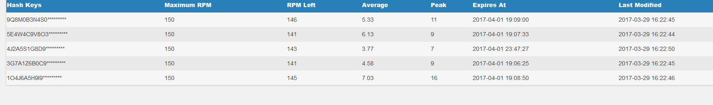
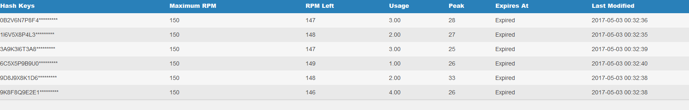

# Status Page

Keeping track of multiple processes, accounts and hashing keys can be a pain. To help, you can use the status page to view the status of each of your workers, their accounts and your hashing keys.

## Setup

There are two steps to enable the status page:
1. Set a password for the status page by adding the `-spp` argument to each worker running the web service or by setting the `status-page-password` field in `config.ini`. A password is required to enable the status page.
2. Give each of your workers a unique "status name" to identify them on the status page by setting the `-sn` argument.

## Accessing
To view your status page, go to `<YourMapUrl>/status` (for example, `http://localhost:5050/status`) and enter the password you defined. The status of each of your workers and hashing keys will be displayed and continually update.
Remember to double-check your hashing keys before starting your instances. Invalid or expired hashing keys currently won't be cleared from the database or status page automatically.

## Screenshots

### Understanding the account stats

`username` - This is the username of the account.

`success` - This is how many times RM attempted to scan with this account and got a good result.

`fail` - This is how many times RM attempted to scan and encountered an exception.

`no items` - This is how many times RM attempted to scan and recieved no results.

`skipped` - This is how many times RM has had to skip a scanning loction because of an exception with this account.

`last modified` - This is the last time the DB has recieved an update about the account.

### Understanding the hashing stats

`remaining` - This is how many requests can be made across instances using this hashing key in the current minute.

`maximum` - This is the most requests per minute that can be made using this hashing key. *Note:* Bossland has reported tracking is off, so you might get slightly more than this.

`peak` - The most requests per minute that has occurred since the last time you started an instance.

`usage` - The average requests made per minute.

`expiration` - When this hashing key is set to expire
